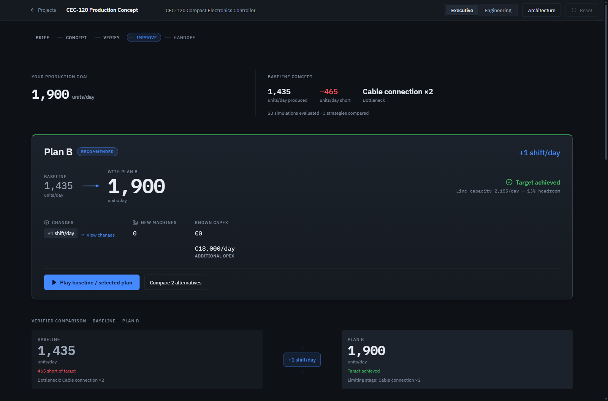
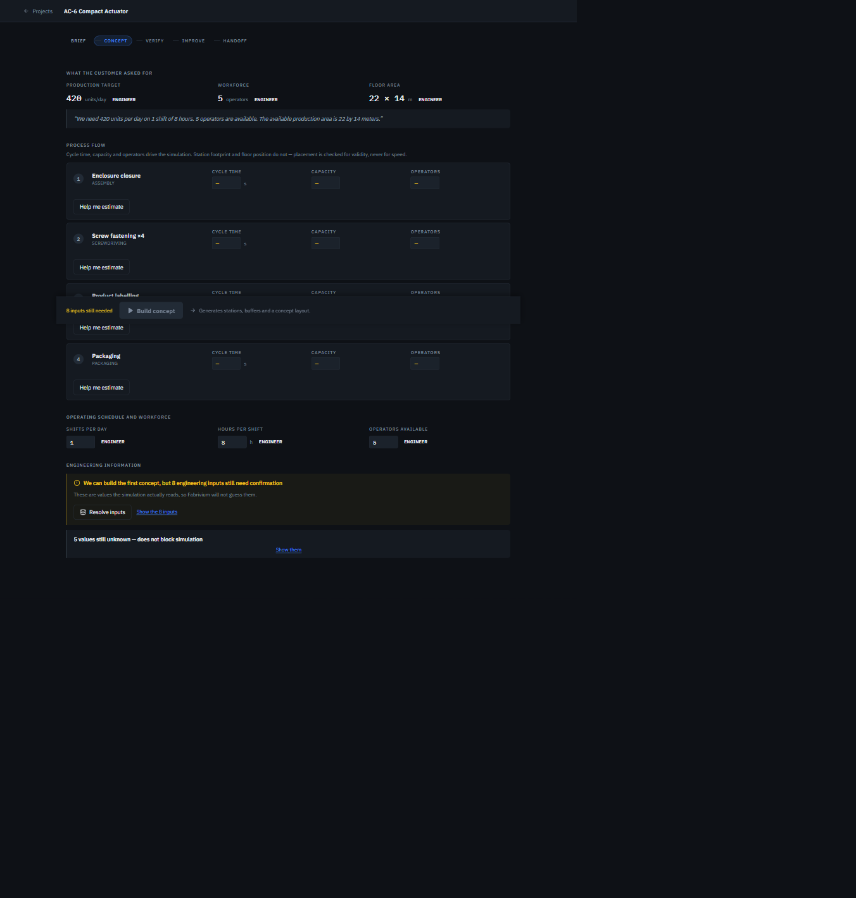
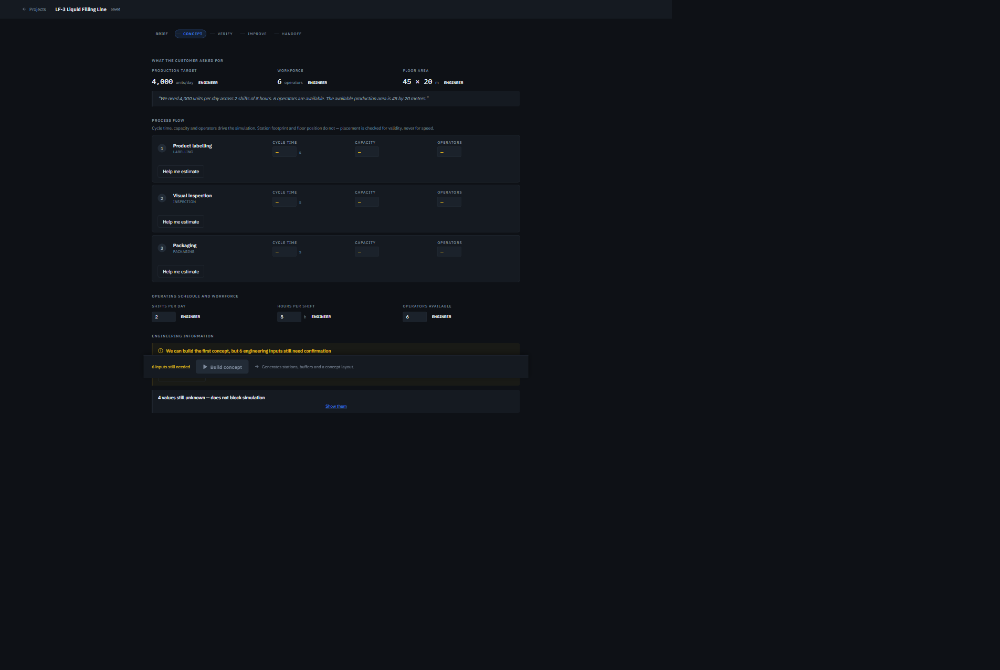
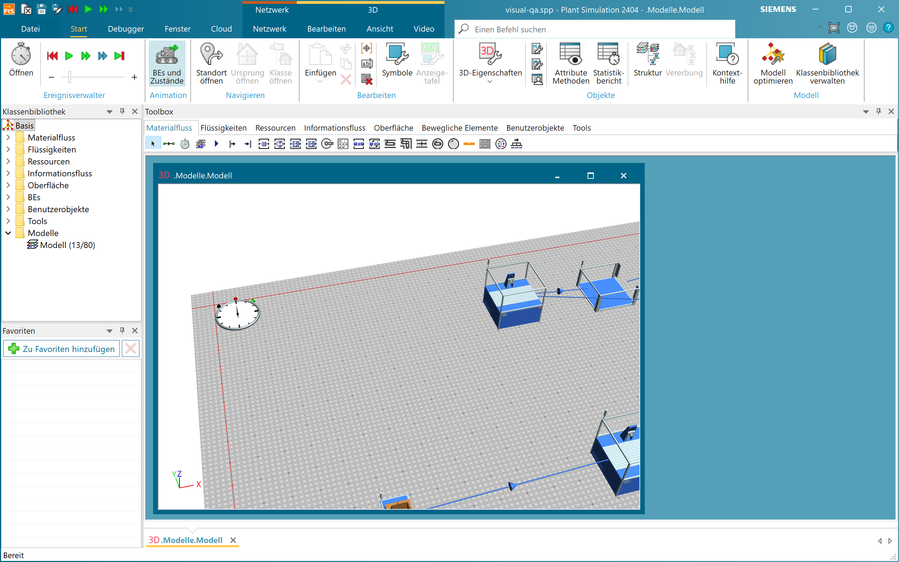

# Fabrivium

### From product requirements to simulation-verified production.

Fabrivium reads a product specification, proposes the manufacturing process it implies, and builds a production concept an engineer can correct. It then verifies the concept with deterministic discrete-event simulation, identifies what limits it, evaluates alternatives, and hands a verified model to Siemens Plant Simulation.

Engineering inputs retain their provenance, while production results come from deterministic computation.

**CEC-120: 1,435 → 1,900 units/day · VERIFIED**  
**23 deterministic simulations · 3 strategies · human-in-the-loop provenance · real Siemens Plant Simulation handoff**

[▶ Watch the 3-minute Fabrivium demo](https://drive.google.com/file/d/1jdW9To8kI1Ssdyd0pu_qTZZpoDzFgoxm/view?usp=drive_link)


> **AI proposes. Engineering knowledge constrains. Simulation proves.**

**Built with IBM Bob** — development, debugging, testing, validation, and product hardening.  
[See how IBM Bob was used →](#built-with-ibm-bob)

---

## Why Fabrivium

A language model can read a specification and propose a production line. It should not be trusted to establish whether that line can actually meet demand or which assumptions the result depends on.

Fabrivium separates these two jobs. Language intelligence reads, extracts, and proposes. A deterministic engineering core calculates, simulates, and verifies.

Unknown values remain explicit and block simulation instead of silently defaulting to zero. Any change to the engineering model invalidates the verification that preceded it.

## How it works

| Stage | What happens | What you can check afterwards |
|---|---|---|
| **UNDERSTAND** | A specification becomes structured manufacturing facts, each citing the sentence it came from | What the document said, and what it did not |
| **ENGINEER** | Operations, resources, estimates, and engineer overrides form a production concept | Where every input came from |
| **VERIFY** | Deterministic discrete-event simulation of that concept | What was simulated, against which inputs |
| **IMPROVE** | Alternatives are generated and simulated, not guessed | What each option delivers, and what is unpriced |
| **HANDOFF** | Supported baseline engineering semantics transfer to Siemens Plant Simulation | What reached the model, and what did not |

Fabrivium refuses to convert a concept while a required engineering input is missing. A missing cycle time stays missing.

## Verified competition case — CEC-120

A compact electronics controller. The line as specified falls short of the customer's target, and closing that gap is the engineering problem.

| Metric | Result |
|---|---:|
| Target | 1,900/day |
| Baseline | 1,435/day |
| Gap | 465/day |
| Constraint | Cable connection ×2 |
| Strategies compared | 3 |
| Deterministic simulations | 23 |
| Verified result | 1,900/day |
| Additional shifts | +1/day |
| New machines | **0** |
| Added known OPEX | €18,000/day |

<!-- MANUAL PLACEHOLDER — REPLACE BEFORE PUBLISHING
Capture the canonical CEC-120 result from the running application
(1,435 baseline · 1,900 verified · 23 simulations · 3 strategies), save it
as docs/assets/cec120-verified-result.png, then replace this comment block with:


-->

The constraint is the two cable connections at 40.0 s — an engineer's override of Fabrivium's 38.5 s estimate. The selected plan buys nothing: the limiting station has headroom the shift pattern is not using, and the cost of using it is a shift rather than a machine. The OPEX is a **commercial figure the engineer supplied**, not something Fabrivium estimated.

**VERIFIED means verified by deterministic simulation of the current engineering model** — the cycle times, schedule, and route actually modelled. It does not mean the source document was proven to contain every manufacturing fact. Every later use of the word carries that same boundary.

## Human-in-the-loop engineering

Provenance is load-bearing, not decoration. An estimate and an engineer's decision are different kinds of information, and Fabrivium keeps them distinguishable for the life of the project.

```text
Cable connection ×2
    38.5 s   ESTIMATED
        |    engineer overrides
    40.0 s   ENGINEER
        |
    verification becomes stale
        |
    simulate again
```

Commercial input follows the same rule: the cost of an extra shift is `UNKNOWN` until an engineer supplies €18,000/day. Only then does the recommendation become cost-complete.

Changing a simulation input invalidates verification. Moving a station on the floor does not, because the simulator does not read layout geometry. Coverage names its own boundary on screen: it reports whether **extracted** requirements are represented and does not claim every manufacturing step was extracted.

## Beyond the competition case

Was Fabrivium built for one demo? A coupling audit answers that by classifying every golden-run token and separating executable code from commentary with Python's tokenizer:

```text
$ cd backend && python -m scripts.fabrivium_coupling_audit
  E PRODUCTION HARD-CODING            0
  F HIDDEN GOLDEN-RUN COUPLING        0
```

No production branch is keyed on the product, the demo, or the golden case. Two further products were run through the **same platform, catalog, and deterministic core**, with the language-model layer disabled for reproducibility.

| | Mechanical — AC-6 actuator | Packaging — LF-3 filling line |
|---|---|---|
| Deterministic simulation | **420 / 420 per day** | **2,952 / 4,000 per day** |
| Constraint | demand met at baseline | packing station |
| Operations | 5, estimated per station with provenance | 3, operator counts left to the engineer |
| Improvement options | — | 3 generated, 2 reach target |
| Browser QA | 1920 / 1440 / 1366, 0 console errors | 1920 / 1440 / 1366, 0 console errors |

| | |
|---|---|
|  |  |
| Mechanical — 420 units/day, five stations | Packaging — 4,000 units/day, three stations |

Both are validated by deterministic simulation of the engineer-confirmed model, and neither route is complete. No current process family covers bearing pressing, lubrication, filling, or sealing, so those operations are absent. The product states that boundary on screen, not only here.

Full account: [multi-domain validation](docs/FABRIVIUM_MULTI_DOMAIN_VALIDATION.md).

## Production architecture

An operation is not required to be a workstation. An engineer can declare that one physical resource performs a contiguous run of operations, and the compiler turns that group into one machine and one route step.

The semantics are deliberately conservative: grouped sequential work content is the **sum** of its operations, capacity is bounded by the tightest member, operator demand follows the most demanding one, and internal buffers are removed while boundary buffers are remapped. Grouping is explicit, reversible, rejected when unsimulatable, and invalidates verification. Automatic production-architecture synthesis remains roadmap.

## Siemens Plant Simulation handoff

Fabrivium drives **Tecnomatix Plant Simulation 2404** over its `RemoteControl` COM interface. It builds the model, saves it, reopens it, and verifies what came back rather than relying on Fabrivium's own UI.

| Verified by read-back | Result |
|---|---:|
| Stations transferred | 6/6 |
| Cycle times | 6/6 |
| Buffers | 5/5 |
| Layout positions | 13/13 |
| Flow connections | 12/12 |



*A Fabrivium-generated `.spp` model opened and executed in Plant Simulation 2404.*

**The transferred model is the baseline engineering concept, and the scope is bounded.** Station names, positions, cycle times, capacities, wired buffers, and the flow chain reach the model. Operator demand, shift pattern, and provenance do not. Compared directly, the two engines agree to within one unit per day while the workforce constraint is not binding and diverge when it is. That constraint does not transfer.

The differences are documented, not tuned away: [cross-simulator semantics](docs/CROSS_SIMULATOR_SEMANTICS.md) · [handoff verification](docs/SIEMENS_HANDOFF_VERIFICATION.md).

## Built with IBM Bob

IBM Bob was used as a development partner throughout Fabrivium's construction for implementation planning, development support, debugging, automated test design, regression analysis, validation, generalization, product hardening, and technical documentation.

The working loop was not "generate code and ship it":

```text
Engineering objective
        |
IBM Bob-assisted implementation, debugging, or test design
        |
Automated tests and regression gates
        |
Engineering review
        |
Accept, or revise and repeat
```

The audits and validation reports under `docs/` are the written trail of that loop, including defects that were found and changes that were rejected.

[See IBM Bob development evidence](docs/IBM_BOB_DEVELOPMENT.md)

### Runtime provider

An IBM Bob inference provider sits behind Fabrivium's language-model abstraction. It is **implemented, wired, and contract-tested**, with 47 tests covering request construction, response parsing, the HTTP error taxonomy, bounded retry, and API-key redaction. **Live runtime validation was not available in the release environment.**

**All engineering metrics reported in this README can be reproduced with the language-model layer disabled.** This keeps deterministic verification independent of provider availability.

### Deterministic boundary

| IBM Bob / language layer | Deterministic engineering core |
|---|---|
| Understand | Calculate |
| Extract | Simulate |
| Propose | Compare |
| Explain | Verify |

This boundary is enforced by test. None of 32 named core modules — including simulation, capacity, sensitivity, candidate search, cost, layout, and the Plant Simulation adapter — may reach the provider layer transitively. Model output reaches engineering state only after JSON parsing, schema and domain validation, and, where required, explicit human acceptance. Production prompts are also checked for domain neutrality.

## Engineering Knowledge Base — implemented

Fabrivium includes 71 versioned, provenanced knowledge items across process, estimation, equipment, validation, layout, and commercial domains, served from `GET /knowledge`.

| Kind | Items |
|---|---:|
| `RULE` | 29 |
| `VALIDATION_RULE` | 12 |
| `EQUIPMENT_EVIDENCE` | 11 |
| `ESTIMATION_METHOD` | 10 |
| `FACT` | 7 |
| `COMPANY_POLICY_REFERENCE` | 1 |
| `STANDARD_REFERENCE` | 1 |

Each item records its source kind (`IMPLEMENTED_RULE`, `REFERENCE_TABLE`, `MANUFACTURER_DOCUMENT`, `EXTERNAL_STANDARD`, `CUSTOMER_RECORD`) so applicability travels with the knowledge. The API reports `claims_standards_compliance: false`: Fabrivium references external standards; it does not certify against them.

## Engineering Skills — next

Fourteen engineering workflows run on the knowledge base today. Packaging them as installable **Skills** — company standards, approved suppliers, cost models, layout rules, and internal practice — is roadmap, not present.

## Architecture

```text
   product specification (PDF, text, or typed input)
                    |
   language / extraction provider   IBM Bob, watsonx, or none
                    |
   typed, schema-validated contracts
                    |
   engineering model    provenance - unknowns - revisions
                    |
   Engineering Knowledge Base + engineer review
                    |
   =========  DETERMINISTIC CORE  =========
     simulation - capacity - cost - layout
   ========================================
                    |
   verification - scenario comparison
                    |
   3D playback   -   Siemens Plant Simulation
```

The provider sits **above** the deterministic core and cannot reach into it.

## Reproducing the CEC-120 case

Source document, customer brief, engineer decisions, and commercial input go through the production HTTP API and return as a simulated 1,435 → 1,900 result. All case-specific inputs live in one machine-readable fixture:

[`examples/electronics/CEC-120_competition_case.json`](examples/electronics/CEC-120_competition_case.json)

That fixture includes the two engineer decisions shown in the demo: the 40.0 s override on Cable connection ×2 and `ASSISTED` automation on Screw fastening ×6 at 39.8 s. Its `expected_results` block is read **only after a run** and is never fed into the calculation.

```bash
cd backend
uvicorn app.main:app
```

In a second terminal:

```bash
cd backend
python scripts/golden_journey_run.py
```

The script uploads the sample specification PDF and drives the production API end to end, printing each computed figure beside its expected counterpart.

Configuration provenance: [CEC-120 case provenance](docs/FABRIVIUM_CEC_CASE_PROVENANCE.md).

## Running Fabrivium locally

**Prerequisites:** Python 3.12+ (developed on 3.14), Node 20+.

### Backend

```bash
cd backend
python -m venv .venv
```

Activate the virtual environment.

Windows:

```powershell
.venv\Scripts\activate
```

macOS/Linux:

```bash
source .venv/bin/activate
```

Install dependencies:

```bash
pip install -r requirements.txt
```

Create the local environment file:

```bash
cp .env.example .env
```

On Windows PowerShell:

```powershell
Copy-Item .env.example .env
```

Start the API:

```bash
uvicorn app.main:app --reload
```

Backend: `http://localhost:8000`  
API docs: `http://localhost:8000/docs`

### Frontend

In a second terminal:

```bash
cd frontend
npm install
npm run dev
```

Frontend: `http://localhost:5173`

Open Fabrivium and choose **Explore the example project**. No language provider or API key is required for this example.

For a backend running on another port, set:

```env
VITE_API_BASE_URL=http://localhost:8001
```

The **Siemens handoff** additionally requires Windows, a local Plant Simulation 2404 installation, and `pywin32`. It is optional and deliberately outside `requirements.txt`; without it, Fabrivium reports that Plant Simulation is unavailable while the rest of the application continues to work.

*Verified from a clean export with a fresh virtual environment, fresh `npm install`, and no reused caches.*

## Tests and validation

| Gate | Result |
|---|---|
| Backend suite | 2,776 passed · 38 skipped · 0 failed |
| Frontend suite | 1,006 passed |
| TypeScript | pass |
| Production build | pass |
| CEC-120 reproduction | pass |
| Coupling audit | class E = 0, class F = 0 |
| Cross-domain browser QA | pass, 0 console errors |

```bash
cd backend
python -m pytest -q
python -m scripts.fabrivium_coupling_audit
python -m pytest tests/test_deterministic_core_isolation.py
```

```bash
cd frontend
npx vitest run
npx tsc --noEmit
npx vite build
```

Live provider tests are opt-in. Test configuration forces the language-model layer off before application import so the normal suite cannot bill an account.

## Repository structure

```text
backend/app/models        domain model: provenance, unknowns, revisions
backend/app/services      engineering core and language boundaries
backend/app/llm           provider abstraction (mock, watsonx, bob)
backend/app/knowledge     Engineering Knowledge Base
backend/app/integrations  Siemens Plant Simulation
backend/scripts           audits, smoke checks, reproducible runs
frontend/src              React workspace
docs/                     provenance and verification records
examples/                 product specifications and reproducible cases
```

[electronics](examples/electronics/) · [mechanical](examples/mechanical/) · [packaging](examples/packaging/) · [claim matrix](docs/FABRIVIUM_CLAIM_MATRIX.md)

## Current limitations

- **Extraction may omit manufacturing steps.** Coverage measures extracted facts, not the complete source document.
- **Verification applies to the current engineering model** — the cycle times, schedule, and route modelled.
- **Reference estimation covers 5 of 12 process families**; researched equipment evidence covers 3.
- **Equipment evidence is bundled and source-referenced**, not a live supplier search.
- **The Siemens handoff has bounded semantics** — operator demand, shifts, and provenance do not transfer.
- **The Bob runtime provider is contract-tested, not live-validated.**
- **Production-architecture synthesis** and **Engineering Skills** remain roadmap.

[Full limitations and roadmap](docs/FABRIVIUM_LIMITATIONS_AND_ROADMAP.md)

## Roadmap

1. Production-architecture synthesis — propose cells and parallel resources for an engineer to accept, then simulate them.
2. Engineering Skills as installable packages.
3. Company-specific knowledge: standards, suppliers, and cost models.
4. Coverage that can identify what was never extracted.
5. Deeper Siemens synchronization, including the workforce constraint.

## Third-party assets

The 3D factory uses the **Kenney Factory Kit 3.0** (author: Kenney, [kenney.nl](https://kenney.nl)) under **CC0 1.0**. Fonts are IBM Plex under SIL OFL 1.1 from npm. The sample specification is original project material generated by a script, and CEC-120 is fictional. Manufacturer equipment data is cited with source URLs rather than redistributed.

[THIRD_PARTY_NOTICES.md](THIRD_PARTY_NOTICES.md)

---

## Fabrivium

**Understand. Engineer. Verify. Scale.**

*Manufacturing engineering, verified.*
