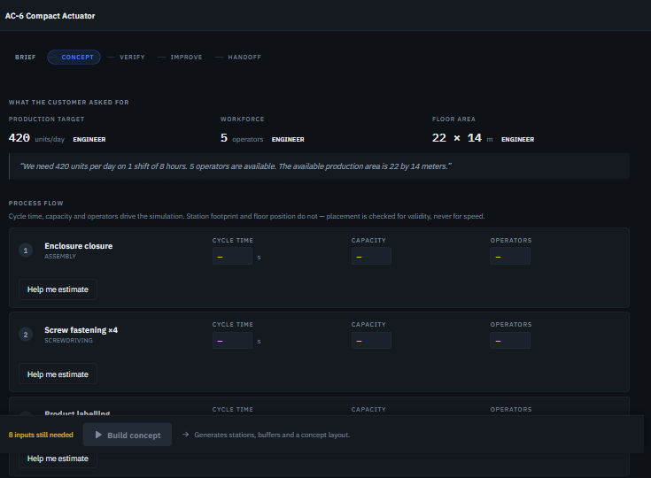
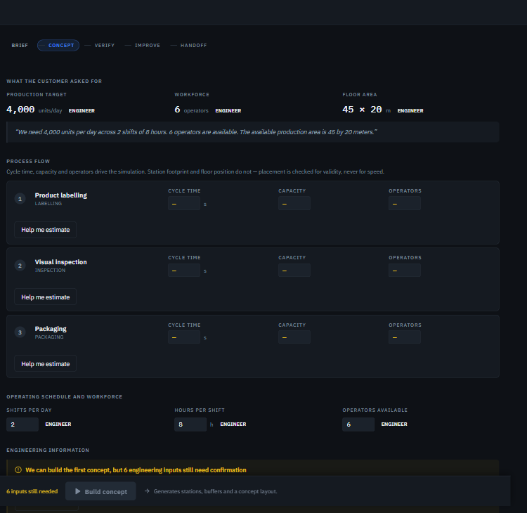

# Fabrivium

### From product requirements to simulation-verified production.

Fabrivium reads a product specification, proposes the manufacturing process it implies, and builds a production concept an engineer can correct. It then verifies that concept with deterministic discrete-event simulation, finds what limits it, tests alternatives, and hands a verified model to Siemens Plant Simulation.

Every engineering input carries a record of where it came from. Every production figure is computed, not guessed.

**CEC-120: 1,435 → 1,900 units/day · VERIFIED**  
**23 deterministic simulations · 3 strategies · human-in-the-loop provenance · real Siemens Plant Simulation handoff**

[▶ Watch the 3-minute Fabrivium demo](https://drive.google.com/file/d/1jdW9To8kI1Ssdyd0pu_qTZZpoDzFgoxm/view?usp=drive_link)


> **AI proposes. Engineering knowledge constrains. Simulation proves.**

**Built with IBM Bob** — development, debugging, testing, validation, and product hardening.  
[See how IBM Bob was used →](#built-with-ibm-bob)

---

## Why Fabrivium

A client arrives with a product and a set of requirements: this many units a day, this many shifts, this floor, this budget. Someone has to answer whether a line can be built that meets them — and those requirements will change at least once before anyone signs anything.

The tool that answers properly is a full simulation model. It is expensive, it is built by a specialist by hand from values re-typed out of documents, and it usually arrives after the structure has already been chosen. So the part of the project where the structure is still cheap to change — the conversation with the client — runs on spreadsheets and experience instead.

**Fabrivium makes that conversation simulable.** A structure goes from the specification to a verified throughput figure in minutes, so it can be shown to the client, corrected, and re-verified while the decision is still open. A requirement that moves invalidates the verification and the line is simulated again. When the structure is agreed, it transfers to Siemens Plant Simulation for the detailed work, with nothing re-typed. And when a line already exists, the same loop answers the other question: where is the constraint, and what is the cheapest way past it?

A language model is very good at the first half of that loop — reading a document, proposing a process — and must not be trusted with the second. It should not decide whether the line meets demand, or which assumptions the answer rests on.

Fabrivium splits those two jobs. The language layer reads, extracts and proposes. A deterministic engineering core calculates, simulates and verifies.

Unknown values stay unknown. They block the simulation instead of quietly becoming zero. Any change to the engineering model cancels the verification that came before it.

## How it works

| Stage | What happens | What you can check afterwards |
|---|---|---|
| **UNDERSTAND** | A specification becomes structured manufacturing facts. Each fact cites the sentence it came from | What the document said, and what it did not |
| **ENGINEER** | Operations, resources, estimates and engineer overrides form a production concept | Where every input came from |
| **VERIFY** | Deterministic discrete-event simulation of that concept | What was simulated, and against which inputs |
| **IMPROVE** | Alternatives are generated and simulated, not guessed | What each option delivers, and what it does not price |
| **HANDOFF** | Supported baseline engineering semantics transfer to Siemens Plant Simulation | What reached the model, and what did not |

Fabrivium will not convert a concept while a required engineering input is missing. A missing cycle time stays missing.

## Verified case study — CEC-120

A compact electronics controller. The line as specified falls short of the customer's target, and closing that gap is the engineering problem.

| Metric | Result |
|---|---:|
| Target | 1,900/day |
| Baseline | 1,435/day |
| Gap | 465/day |
| Constraint | Cable connection ×2 |
| Strategies compared | 3 |
| Deterministic simulations | 23 |
| Verified result | 1,900/day |
| Additional shifts | +1/day |
| New machines | **0** |
| Added known OPEX | €18,000/day |


**[See the whole run, screen by screen →](docs/GOLDEN_RUN_WALKTHROUGH.md)**

The constraint is the two cable connections at 40.0 s. That number is an engineer's override of Fabrivium's 38.5 s estimate.

The recommended plan adds no equipment. The limiting station still has spare capacity, and the cheapest way to use it is another shift rather than another machine. The €18,000/day is a commercial figure the **engineer supplied**. Fabrivium did not estimate it.

**VERIFIED means two things happened.** An engineer confirmed the engineering inputs — every cycle time, capacity, operator count and schedule the simulation reads — and the deterministic simulator then ran that confirmed model. Both are recorded: the inputs carry the engineer's decision, and the result carries the run that produced it.

## Human-in-the-loop engineering

Provenance is load-bearing here, not decoration. An estimate and an engineer's decision are different kinds of information, and Fabrivium keeps them apart for the life of the project.

```text
Cable connection ×2
    38.5 s   ESTIMATED
        |    engineer overrides
    40.0 s   ENGINEER
        |
    verification becomes stale
        |
    simulate again
```

Commercial input follows the same rule. The cost of an extra shift is `UNKNOWN` until an engineer supplies €18,000/day. Only then is the recommendation cost-complete.

Changing a simulation input cancels verification. Moving a station on the floor does not, because the simulator does not read layout geometry. Coverage states its own boundary on screen: it reports whether **extracted** requirements are represented, and it does not claim that every manufacturing step was extracted.

## Beyond the case study

Was Fabrivium built for one demo? A coupling audit answers that. It classifies every golden-run token in the tree and separates executable code from commentary using Python's own tokenizer:

```text
$ cd backend && python -m scripts.fabrivium_coupling_audit ; echo "exit $?"
scanned 496 files
  A TEST FIXTURE                   1672
  B EXAMPLE DATA                   4697
  C COMPETITION COPY               386
  D DOMAIN DEFAULT                 76
exit 0
```

Class **E** (production hard-coding) and class **F** (hidden golden-run coupling) print nothing because both are empty. The script exits `1` if either is not, so it can gate a build. No production branch is keyed on the product, the demo or the golden case.

Two further products were then run through the **same platform, catalog and deterministic core**, with the language-model layer switched off so the runs reproduce.

| | Mechanical — AC-6 actuator | Packaging — LF-3 filling line |
|---|---|---|
| Deterministic simulation | **420 / 420 per day** | **2,952 / 4,000 per day** |
| Constraint | demand met at baseline | packing station |
| Operations | 5, estimated per station with provenance | 3, operator counts left to the engineer |
| Improvement options | — | 3 generated, 2 reach target |
| Browser QA | 1920 / 1440 / 1366, 0 console errors | 1920 / 1440 / 1366, 0 console errors |

| | |
|---|---|
|  |  |
| Mechanical — AC-6, 420 units/day asked for | Packaging — LF-3, 4,000 units/day asked for |

Both screenshots are the same moment in each project: the point where Fabrivium has read the document and **refuses to invent the numbers the simulation would read**. Every cycle time, capacity and operator count is empty, and the product says how many inputs it still needs. The figures in the table above come after those inputs were supplied.

Both results come from deterministic simulation of the engineer-confirmed model, and neither route is complete: no process family covers bearing pressing, lubrication, filling or sealing, so those operations are absent. The product says so on screen, not only here.

Full account: [multi-domain validation](docs/FABRIVIUM_MULTI_DOMAIN_VALIDATION.md) · [coupling audit](docs/FABRIVIUM_GENERALIZATION_AUDIT.md) · [cases A–C](docs/GENERALIZATION_VALIDATION_REPORT.md).

## Production architecture

An operation does not have to be a workstation. An engineer can declare that one physical resource performs several operations in a row, and the compiler turns that group into one machine and one route step.

The rules are deliberately conservative: grouped work content is the **sum** of its operations, capacity follows the tightest member, operator demand follows the most demanding one, and internal buffers are removed. Grouping is explicit, reversible, rejected when it cannot be simulated, and it cancels verification. Proposing such groups automatically is still roadmap.

## Siemens Plant Simulation handoff

Fabrivium drives **Tecnomatix Plant Simulation 2404** through its `RemoteControl` COM interface. It builds the model, saves it, reopens it, and verifies what came back instead of trusting its own UI.


*Left: an unretouched capture of the generated model in Plant Simulation 2404. Right: what was read back out of the saved file. [Full screenshot](docs/images/fabrivium-siemens-3d.png).*

**The transferred model is the baseline engineering concept, and its scope is bounded.** Station names, positions, cycle times, capacities, wired buffers and the flow chain reach the model. Operator demand, shift pattern and provenance do not.

The two engines were then run against each other on the same models. Where Fabrivium's workforce constraint is not binding they agree: **1,104 vs 1,104 units/day, and 2,463 vs 2,462** on a second scenario — and both engines name the **same limiting station** in every case. Where the workforce constraint binds they differ by a known amount, because the workforce does not transfer. The scenarios, the predictions and the pass/fail tolerance were **written down before the first model was executed**, and the full results are published scenario by scenario.

[Preregistration](docs/CROSS_SIMULATOR_VALIDATION_PLAN.md) · [validation report](docs/CROSS_SIMULATOR_VALIDATION_REPORT.md) · [raw run record](docs/evidence/cross_simulator_evidence.json) · [semantics](docs/CROSS_SIMULATOR_SEMANTICS.md) · [handoff verification](docs/SIEMENS_HANDOFF_VERIFICATION.md)

## Built with IBM Bob

IBM Bob was used as a development partner from the first architecture sketch to the last regression run:

- **Architecture and planning** — working out which mechanisms the product actually needs (provenance that survives an edit, unknowns that block a run, revision invalidation, the boundary between the language layer and the engineering core), and breaking the build into stages that could each be verified before the next one started.
- **Concept design** — how a specification becomes an engineering model, and where a human decision has to sit in that chain.
- **Implementation and debugging** across backend, frontend and the Siemens integration.
- **Test design and regression analysis** — including the audits and validation reports under `docs/`.
- **The runtime provider** — Bob's inference API, implemented behind Fabrivium's language abstraction.

The working loop was not "generate code and ship it":

```text
Engineering objective
        |
IBM Bob-assisted implementation, debugging, or test design
        |
Automated tests and regression gates
        |
Engineering review
        |
Accept, or revise and repeat
```

The audits and validation reports under `docs/` are the written trail of that loop, including defects that were found and changes that were rejected.

[See IBM Bob development evidence](docs/IBM_BOB_DEVELOPMENT.md)

### Runtime provider

An IBM Bob inference provider sits behind Fabrivium's language-model abstraction. It is **implemented, wired and contract-tested**, with 47 tests covering request construction, response parsing, the HTTP error taxonomy, bounded retry and API-key redaction. Selecting it is one setting: `FACTORYMIND_LLM_PROVIDER=bob`.

The path was exercised live during development, through Bob's inference API, and it worked. No transcript was kept from those runs, so the evidence this repository ships is reproducible rather than anecdotal: the contract suite, and `python -m scripts.bob_smoke`, which repeats the live check in one command on any machine with a key.

The language layer has also run live against **IBM Granite on watsonx.ai** (`ibm/granite-4-h-small`, eu-de). That account is on the Lite plan and its inference allowance is now spent, so calls return `403 token_quota_reached`, the deterministic estimator takes over, and provenance records that the fallback ran — behaviour pinned by `test_phase9b_quota_fallback.py`.

**Every engineering metric in this README can be reproduced with the language-model layer switched off.** That keeps deterministic verification independent of provider availability.

### Deterministic boundary

| IBM Bob / language layer | Deterministic engineering core |
|---|---|
| Understand | Calculate |
| Extract | Simulate |
| Propose | Compare |
| Explain | Verify |

A test enforces this boundary: none of 32 named core modules — simulation, capacity, sensitivity, candidate search, cost, layout and the Plant Simulation adapter among them — may reach the provider layer, directly or indirectly. Model output reaches engineering state only after JSON parsing, schema and domain validation, and, where required, explicit human acceptance. Production prompts are also checked for domain neutrality.

## Engineering Knowledge Base — implemented

Fabrivium includes 71 versioned knowledge items with provenance, across process, estimation, equipment, validation, layout and commercial domains. They are served from `GET /knowledge`.

| Kind | Items |
|---|---:|
| `RULE` | 29 |
| `VALIDATION_RULE` | 12 |
| `EQUIPMENT_EVIDENCE` | 11 |
| `ESTIMATION_METHOD` | 10 |
| `FACT` | 7 |
| `COMPANY_POLICY_REFERENCE` | 1 |
| `STANDARD_REFERENCE` | 1 |

Each item records its source kind (`IMPLEMENTED_RULE`, `REFERENCE_TABLE`, `MANUFACTURER_DOCUMENT`, `EXTERNAL_STANDARD`, `CUSTOMER_RECORD`), so applicability travels with the knowledge. The API reports `claims_standards_compliance: false`. Fabrivium references external standards; it does not certify against them.

[Engineering Knowledge Base](docs/FABRIVIUM_ENGINEERING_KNOWLEDGE_BASE.md)

## Engineering Skills — next

Fourteen engineering workflows run on the knowledge base today. Packaging them as installable **Skills** — company standards, approved suppliers, cost models, layout rules and internal practice — is roadmap, not present.

## Architecture

![Fabrivium architecture: a product specification feeds a language and extraction provider marked PROBABILISTIC, whose output passes through typed schema-validated contracts, the engineering model with provenance and unknowns, and the Engineering Knowledge Base with engineer review. A dashed line marked "nothing above this line can reach below it, enforced by test" separates all of that from the deterministic engineering core of simulation, capacity, cost and layout, which feeds verification and scenario comparison, and then 3D playback and Siemens Plant Simulation](docs/assets/fabrivium-architecture.png)

The provider sits **above** the deterministic core and cannot reach into it. `tests/test_deterministic_core_isolation.py` enforces that: no core module may import the provider layer, directly or indirectly.

## Reproducing the CEC-120 case

The source document, the customer brief, the engineer decisions and the commercial input all go through the production HTTP API and come back as a simulated 1,435 → 1,900 result. Every case-specific input lives in one machine-readable fixture:

[`examples/electronics/CEC-120_competition_case.json`](examples/electronics/CEC-120_competition_case.json)

That fixture holds the two engineer decisions shown in the demo: the 40.0 s override on Cable connection ×2, and `ASSISTED` automation on Screw fastening ×6 at 39.8 s. Its `expected_results` block is read **only after a run** and is never fed into the calculation.

```bash
cd backend
uvicorn app.main:app
```

In a second terminal:

```bash
cd backend
python scripts/golden_journey_run.py
```

The script uploads the sample specification PDF, drives the production API end to end, and prints each computed figure beside its expected counterpart.

Configuration provenance: [CEC-120 case provenance](docs/FABRIVIUM_CEC_CASE_PROVENANCE.md).

## Running Fabrivium locally

**Prerequisites:** Python 3.12+ (developed on 3.14), Node 20+.

### Backend

```bash
cd backend
python -m venv .venv
```

Activate the virtual environment.

Windows:

```powershell
.venv\Scripts\activate
```

macOS/Linux:

```bash
source .venv/bin/activate
```

Install dependencies:

```bash
pip install -r requirements.txt
```

Create the local environment file:

```bash
cp .env.example .env
```

On Windows PowerShell:

```powershell
Copy-Item .env.example .env
```

Start the API:

```bash
uvicorn app.main:app --reload
```

Backend: `http://localhost:8000`  
API docs: `http://localhost:8000/docs`

### Frontend

In a second terminal:

```bash
cd frontend
npm install
npm run dev
```

Frontend: `http://localhost:5173`

Open Fabrivium and choose **Explore the example project**. That example needs no language provider and no API key.

For a backend on another port, set:

```env
VITE_API_BASE_URL=http://localhost:8001
```

The **Siemens handoff** also needs Windows, a local Plant Simulation 2404 installation and `pywin32`. It is optional and deliberately outside `requirements.txt`. Without it, Fabrivium reports that Plant Simulation is unavailable and the rest of the application keeps working.

*Verified from a clean export with a fresh virtual environment, a fresh `npm install` and no reused caches.*

## Tests and validation

Nothing here has to be taken on trust. Every claim in this README maps to a command or a file:

| If you doubt | Check |
|---|---|
| the case study | `python scripts/golden_journey_run.py` — reproduces 1,435 → 1,900 from the source PDF |
| that it only works on the demo | `python -m scripts.fabrivium_coupling_audit`, then read `examples/generalization/results/*.json` |
| the Siemens agreement | [`docs/evidence/cross_simulator_evidence.json`](docs/evidence/cross_simulator_evidence.json), scored against a tolerance fixed [in advance](docs/CROSS_SIMULATOR_VALIDATION_PLAN.md) |
| that the model layer touches the numbers | `python -m pytest tests/test_deterministic_core_isolation.py` |

| Gate | Result |
|---|---|
| Backend suite | 2,776 passed · 38 skipped · 0 failed |
| Frontend suite | 1,006 passed |
| TypeScript | pass |
| Production build | pass |
| CEC-120 reproduction | pass |
| Coupling audit | class E = 0, class F = 0 |
| Cross-domain browser QA | pass, 0 console errors |

```bash
cd backend
python -m pytest -q
python -m scripts.fabrivium_coupling_audit
python -m pytest tests/test_deterministic_core_isolation.py
```

```bash
cd frontend
npx vitest run
npx tsc --noEmit
npx vite build
```

Live provider tests are opt-in. The test configuration switches the language-model layer off before the application is imported, so the normal suite cannot bill an account.

## Repository structure

```text
backend/app/models        domain model: provenance, unknowns, revisions
backend/app/services      engineering core and language boundaries
backend/app/llm           provider abstraction (mock, watsonx, bob)
backend/app/knowledge     Engineering Knowledge Base
backend/app/integrations  Siemens Plant Simulation
backend/scripts           audits, smoke checks, reproducible runs
frontend/src              React workspace
docs/                     provenance and verification records
examples/                 product specifications and reproducible cases
```

[electronics](examples/electronics/) · [mechanical](examples/mechanical/) · [packaging](examples/packaging/) · [generalization cases](examples/generalization/)

### A note on the name

The project was called **FactoryMind** before it became Fabrivium. The rename is complete everywhere a user reads, and deliberately unfinished in three places where changing a name would break something: the `FactoryMindExchange` class, which names the Plant Simulation exchange package and appears inside generated exchange files; the `X-FactoryMind-Skills` HTTP header shared by backend and frontend; and the `FACTORYMIND_…` environment-variable prefix that every existing local `.env` depends on.

So a variable or a class in the code may still carry the old name. All three can be renamed together at a release boundary, with a migration note. None of them can be renamed quietly.

## Documentation

Start with the [claim matrix](docs/FABRIVIUM_CLAIM_MATRIX.md). No statement anywhere in this repository may exceed a row in it. Then:

[Roadmap](docs/FABRIVIUM_ROADMAP.md) · [CEC-120 case provenance](docs/FABRIVIUM_CEC_CASE_PROVENANCE.md) · [Siemens handoff verification](docs/SIEMENS_HANDOFF_VERIFICATION.md) · [cross-simulator validation](docs/CROSS_SIMULATOR_VALIDATION_REPORT.md) · [multi-domain validation](docs/FABRIVIUM_MULTI_DOMAIN_VALIDATION.md)

**Full index: [`docs/`](docs/)** — claims, audits, validation runs and the Siemens work.

## Where this goes next

An engineer does not draw five stations in a row. They decide how many cells, which resources are shared, and what the company's own standards allow. That is the product Fabrivium is being built toward.

1. **Production architecture synthesis** — propose cells, parallel resources and shared resources, simulate each, and let the engineer choose. Grouping already exists; proposing it does not, and this step is bigger than everything below it.
2. **Typed units and currency** — demand stated per hour, per shift or per week; a currency mismatch that refuses rather than converts.
3. **Domain context** — scoped vocabularies that can also declare themselves absent.
4. **Coverage that knows what it missed** — measured against the document, not against what was extracted from it.
5. **Engineering Skills as installable packages** — a company's own standards, suppliers, cost models and layout rules.
6. **A recorded live run of the Bob runtime path** — the path works and is contract-tested; the next step is shipping the transcript as evidence rather than as a statement.
7. **Estimation coverage beyond five families**, and deeper Siemens synchronization including the workforce constraint.

[Full roadmap: what exists, what is next, and how each step gets proved](docs/FABRIVIUM_ROADMAP.md)

## Third-party assets

The 3D factory uses the **Kenney Factory Kit 3.0** (author: Kenney, [kenney.nl](https://kenney.nl)) under **CC0 1.0**. Fonts are IBM Plex under SIL OFL 1.1, from npm. The sample specification is original project material generated by a script, and CEC-120 is fictional. Manufacturer equipment data is cited with source URLs rather than redistributed.

[THIRD_PARTY_NOTICES.md](THIRD_PARTY_NOTICES.md)

---

## Fabrivium

**Understand. Engineer. Verify. Scale.**

*Manufacturing engineering, verified.*
