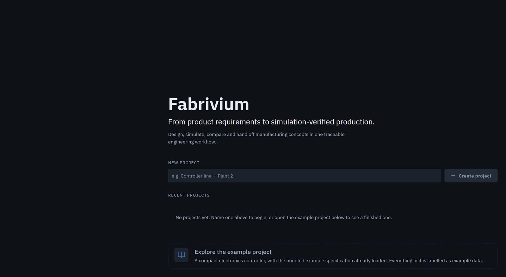
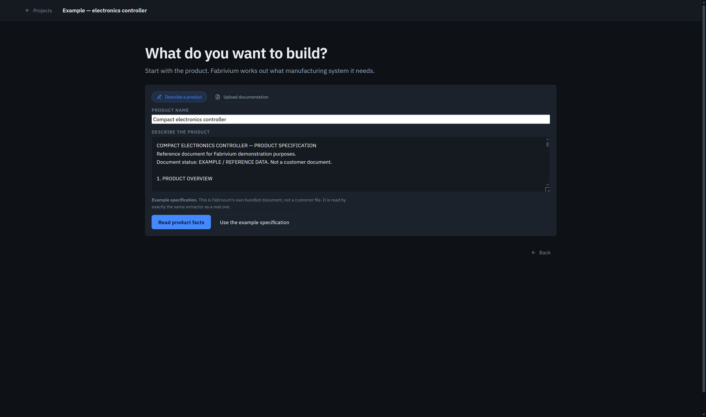
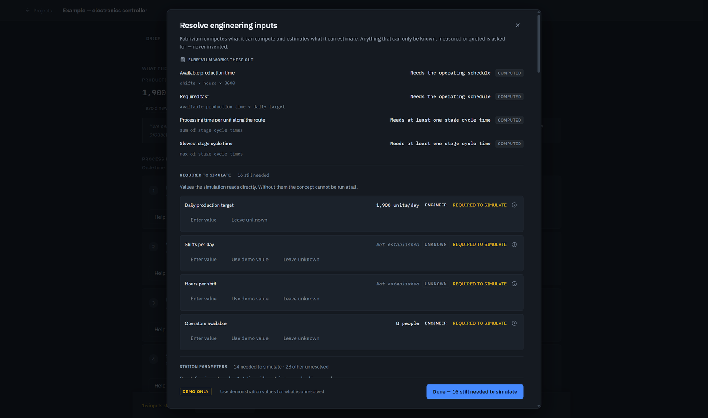

# The run, screen by screen

This is the CEC-120 case as the product actually shows it — the same path the
demo film takes, captured from the build in this repository with the
**language-model layer switched off**.

Nothing here is a mock-up. Every screen below is reachable in a few minutes:

```bash
cd backend && uvicorn app.main:app          # terminal 1
cd frontend && npm install && npm run dev   # terminal 2
```

Then open the app and choose **Explore the example project**. No provider and
no API key are needed.

---

## 1 · Start



A project is a named, saved thing. The example project carries Fabrivium's own
bundled specification, and everything that comes out of it is labelled as
example data.

---

## 2 · The document



A specification arrives as a PDF or as text. This one is Fabrivium's own
example document — **read by exactly the same extractor as a customer file**,
which is the only reason it is worth showing.

---

## 3 · What was read, and what was not


Every fact carries a **`Document`** badge and an **Evidence** link. The expanded
one shows the sentence it was taken from — *"pre-crimped connectors and are
attached by hand during assembly."*

Underneath is the part most tools leave out: **STILL NEEDED**. The document
never states the screw thread, drive type or torque, so Fabrivium says so and
names what that blocks — equipment validation. It does not invent a screw.

---

## 4 · The process, with its reasoning attached


Seven operations, in route order, each proposed by a **rule** rather than a
guess. Opening *"Why Cable connection ×2 was proposed"* shows the rule, the
requirement it answers (`connection.cable.count`) and the sentence behind it.

The coverage panel is the honest half. It reports **extracted-requirement
coverage** — not coverage of the document — and it quotes the requirement no
operation answers yet: *"The enclosure base and lid are moulded in ABS."* An
engineer either adds an operation, links an existing one, or records it as out
of scope. Until then the concept cannot be built.

---

## 5 · A concept with no numbers in it yet


The brief has been read — target, workforce, floor, and the customer's stated
preference to avoid new machines — and each value is labelled with where it
came from.

The engineering inputs are **empty**, and the bar says exactly how many are
missing. This is the state the product is designed to sit in: it will not
simulate a line whose cycle times nobody has supplied.

---

## 6 · What Fabrivium will supply, and what it refuses to



> *"Fabrivium computes what it can compute and estimates what it can estimate.
> Anything that can only be known, measured or quoted is asked for — never
> invented."*

The panel separates three kinds of number and never blurs them:

| Tag | Meaning |
|---|---|
| **`COMPUTED`** | Derived, with the formula shown — available time is `shifts × hours × 3600`, takt is `available time ÷ daily target` |
| **`ENGINEER`** | A person supplied it; the target of 1,900/day and the eight operators came from the customer's brief |
| **`UNKNOWN`** | Nobody has supplied it. It stays unknown and blocks the run |

`REQUIRED TO SIMULATE` marks the values the simulator reads directly. Demo
values exist, but they are badged **DEMO ONLY** wherever they are offered.

---

## 7 · Verified, then improved


With the inputs supplied — including the engineer's override of Cable
connection ×2 to **40.0 s**, and `ASSISTED` automation on Screw fastening ×6 —
the concept simulates at **1,435 units/day** against a target of 1,900, and the
constraint is named.

Fabrivium then generates strategies and simulates each one: **23 deterministic
simulations across 3 strategies**. The recommended plan reaches **1,900/day**
with **one extra shift and no new machines**, because the limiting station
still has capacity the shift pattern was not using. The €18,000/day is the
engineer's own commercial figure — Fabrivium does not price money it was not
given.

Which inputs produced which figure: [CEC-120 case provenance](FABRIVIUM_CEC_CASE_PROVENANCE.md).

---

## 8 · Handed to Siemens


The agreed structure is written into **Tecnomatix Plant Simulation 2404**
through its own `RemoteControl` COM interface, then saved, closed, reopened and
verified out of the file that came back.

What transfers and what does not is stated rather than implied:
[handoff verification](SIEMENS_HANDOFF_VERIFICATION.md) ·
[cross-simulator semantics](CROSS_SIMULATOR_SEMANTICS.md).

---

## Reproducing the numbers without a browser

The same journey runs headless through the production HTTP API:

```bash
cd backend
python scripts/golden_journey_run.py
```

It uploads the specification PDF, drives the API end to end, and prints each
computed figure beside its expected counterpart. Every input the case needs
lives in one fixture,
[`examples/electronics/CEC-120_competition_case.json`](../examples/electronics/CEC-120_competition_case.json),
whose `expected_results` block is read **only after** a run.
